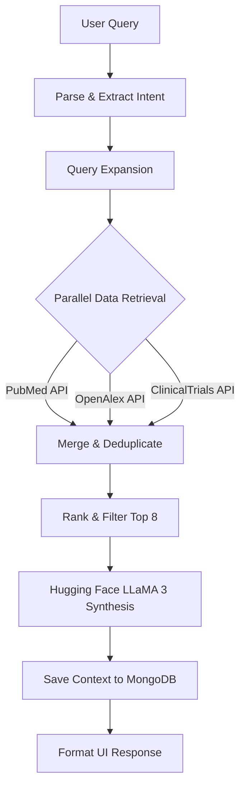

# AI-Powered-medical-Assistant-1
Curalink is a full-stack **AI-powered medical research assistant** built using the MERN stack.   It intelligently understands user queries, retrieves high-quality medical data, and generates **structured, evidence-based insights** using open-source LLMs.

<div align="center">
  
  <h1>Curalink</h1>
  <p><strong>AI-Powered Medical Research Assistant</strong></p>
  <p>A full-stack intelligent platform that aggregates, ranks, and analyzes medical research using open-source Large Language Models.</p>

  [](#)
  [](#)
  [](#)
  [](#)
  [](#)
</div>

<hr />

## 📖 Table of Contents
- [About the Project](#-about-the-project)
- [Key Features](#-key-features)
- [Tech Stack](#-tech-stack)
- [Architecture & Data Flow](#-architecture--data-flow)
- [Getting Started](#-getting-started)
- [API Documentation](#-api-documentation)
- [Limitations & Roadmap](#-limitations--roadmap)
- [License](#-license)

---

## 🔬 About the Project

**Curalink** is an advanced MERN stack application designed for medical professionals, researchers, and patients. It acts as an intelligent medical assistant that takes a natural language query, expands it using medical synonyms, parallel-fetches data from authoritative medical databases, ranks the results using a proprietary algorithm, and synthesizes a grounded response using **Hugging Face's LLaMA 3** AI model.

Instead of relying on AI hallucinations, Curalink ensures that every insight is strictly backed by the top-ranked PubMed, OpenAlex, and ClinicalTrials.gov sources retrieved during the query.

---

## ✨ Key Features

- 🧠 **Intelligent Query Expansion:** Automatically extracts diseases and intent, generating synonyms to ensure comprehensive database searching.
- 📡 **Multi-Source Aggregation:** Simultaneously queries **PubMed** (publications), **OpenAlex** (academic metadata), and **ClinicalTrials.gov** (active studies).
- 🏆 **Smart Ranking Algorithm:** Scores retrieved articles based on Keyword Relevance (25%), Disease Match (25%), Recency (15%), Citations (15%), Credibility (10%), and Location Match (10%).
- 🤖 **Grounded AI Synthesis:** Leverages the official `@huggingface/inference` SDK to generate evidence-based overviews, research insights, and personalized recommendations using **Llama 3**.
- 💬 **Contextual Memory:** Maintains session history across multi-turn conversations so follow-up questions remain in context.
- 🎨 **Modern UX/UI:** Fully responsive dark-mode interface built with TailwindCSS and Lucide React icons.

---

## 🛠 Tech Stack

### Frontend
- **Framework:** React 18 (Vite)
- **Styling:** TailwindCSS
- **Icons:** Lucide React
- **Routing:** React Router v6
- **HTTP Client:** Axios

### Backend
- **Environment:** Node.js
- **Framework:** Express.js
- **Database:** MongoDB (Mongoose)
- **Security:** Helmet, Express-Rate-Limit, CORS
- **AI Integration:** `@huggingface/inference`

### External APIs
- **AI Generation:** Hugging Face Inference API (`meta-llama/Meta-Llama-3-8B-Instruct`)
- **Medical Data:** PubMed E-Utilities, OpenAlex API, ClinicalTrials.gov v2

---

## 🏗 Architecture & Data Flow



---

## 🚀 Getting Started

### Prerequisites
- Node.js (v16 or higher)
- MongoDB (Local instance or MongoDB Atlas cluster)
- [Hugging Face API Key](https://huggingface.co/settings/tokens)

### 1. Clone the Repository
```bash
git clone https://github.com/WebDevEJAJ/AI-Powered-medical-Assistant-1.git
cd AI-Powered-medical-Assistant-1
```

### 2. Backend Setup
```bash
cd backend
npm install

# Create environment variables
cat << EOF > .env
PORT=5000
NODE_ENV=development
MONGODB_URI=mongodb://localhost:27017/curalink
CORS_ORIGIN=http://localhost:5173

# Hugging Face Settings
HF_API_KEY=your_hf_access_token_here
HF_MODEL=meta-llama/Meta-Llama-3-8B-Instruct

# Weights (Optional Customization)
WEIGHT_KEYWORD_RELEVANCE=0.25
WEIGHT_DISEASE_MATCH=0.25
EOF

# Start the development server
npm start
```

### 3. Frontend Setup
```bash
cd ../frontend
npm install

# Create environment variables
cat << EOF > .env
VITE_API_URL=http://localhost:5000/api
EOF

# Start the Vite development server
npm run dev
```

The application will now be running at `http://localhost:5173`.

---

## 📚 API Documentation

### 1. User Registration / Session Creation
**`POST /api/users/register`**
Initializes a user session and profile for personalized insights.
```json
{
  "name": "Jane Doe",
  "age": 42,
  "gender": "female",
  "location": "London, UK"
}
```

### 2. Search & Synthesize
**`POST /api/search/search`**
Triggers the full extraction, retrieval, ranking, and AI synthesis pipeline.
```json
{
  "query": "What are the latest treatments for Parkinson's Disease?",
  "userContext": { "age": 42, "gender": "female" }
}
```

### 3. Contextual Chat
**`POST /api/search/chat`**
Follow up on a previous search while maintaining memory.
```json
{
  "query": "Are there any side effects to those treatments?",
  "sessionId": "session_uuid_here",
  "userId": "user_uuid_here"
}
```

---

## 🚨 Limitations & Roadmap

### Current Limitations
- **API Limits:** Dependent on Hugging Face free-tier token limits.
- **Authentication:** Uses temporary session IDs rather than secure JWT/OAuth login.
- **Media:** Strictly text-based (no medical imaging support).

### Roadmap
- [ ] Implement strict JWT User Authentication.
- [ ] Add ability to save, bookmark, and export articles to PDF.
- [ ] Integrate Drug-to-Drug Interaction (DDI) checker APIs.
- [ ] Multi-language localization support.

---

## 📄 License

This project is licensed under the MIT License - see the `LICENSE` file for details.

<div align="center">
  <b>Made with ❤️ for medical research</b>
</div>
